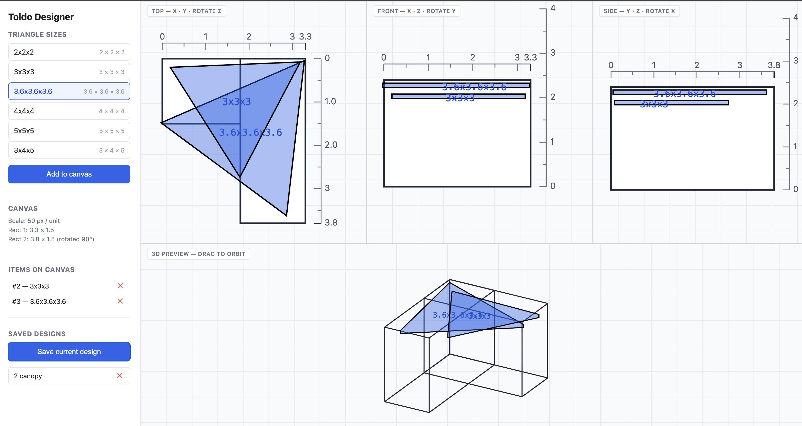

# Toldo Designer

A browser-based layout tool for planning **triangular sail shade canopies** (toldos / shade sails — like [these](https://www.amazon.co.uk/dp/B07N832PST/)) over a fixed outdoor area.

You drag canopy triangles around an L-shaped ground plan, rotate them, and check coverage from the top, front, side, and a live 3D preview before buying or installing anything.



## What the shapes mean

- **Triangles** — physical sail shades. Each triangle on the canvas represents one canopy with a real-world side length (e.g. `3 × 3 × 3` metres). The fabric is what actually casts the shade.
- **Rectangles** — the ground area you want to cover. The base is an L-shape made of two rectangles:
  - `Rect 1`: `3.3 × 1.5` units
  - `Rect 2`: `3.8 × 1.5` units, rotated 90° and joined to Rect 1 to form the L
- **Grid** — `1 unit = 50 px` at default zoom. Units are intended to map to metres, so a `3×3×3` triangle is a 3 m equilateral sail.

The goal is to position and rotate triangles so their combined footprint covers as much of the L-shaped area as possible without wasting fabric or leaving gaps.

## Features

### Multi-view editing

Four synchronised viewports of the same 3D scene:

| View       | Plane        | Rotation editable |
| ---------- | ------------ | ----------------- |
| Top        | X · Y        | rotate Z          |
| Front      | X · Z        | rotate Y          |
| Side       | Y · Z        | rotate X          |
| 3D Preview | orbit camera | drag to orbit     |

Move a triangle in any orthographic view and the other views update live. The 3D preview shows the toldo as a solid prism above the L-shape so you can see how the sails sit in space.

### Triangle catalogue

Predefined canopy sizes you can drop onto the canvas:

- `2 × 2 × 2`
- `3 × 3 × 3`
- `3.6 × 3.6 × 3.6`
- `4 × 4 × 4`
- `5 × 5 × 5`
- `3 × 4 × 5` (right-angle)

Edit `config.triangleSizes` in [app.js](app.js) to add your own.

### Direct manipulation

- **Drag** a triangle to move it (in any of the three orthographic views).
- **Rotate handle** — orange knob attached to the apex; drag to rotate around the view's perpendicular axis.
- **Delete handle** — red X appears next to the selected triangle.
- **Selection** — click to select; the handles only appear on the selected triangle.

### Rulers and grid

Each view has rulers along the edges of the base shape so you can read off real-world distances. The background grid is `1 unit` per cell at default zoom.

### Trackpad zoom + pan

- Pinch / scroll-wheel to zoom **around the cursor** (not the canvas centre).
- Each view tracks its own zoom and pan independently.
- The 3D preview supports drag-to-orbit (azimuth + elevation).

### Persistence

- **Autosave** — the current design is written to `localStorage` on every change, so reloading the page restores exactly what you had (positions, rotations, zoom, pan).
- **Named designs** — click _Save current design_, give it a name, and load or delete it later from the sidebar.

Storage keys:

- `toldo:designs` — named designs
- `toldo:autosave` — last working state

## Running it

It is a static site with **no build step and no dependencies** — pure HTML, CSS, and vanilla JavaScript with SVG.

```bash
# any static server works; for example:
python3 -m http.server 8000
# then open http://localhost:8000
```

Or just open [index.html](index.html) directly in a browser.

## Project layout

- [index.html](index.html) — sidebar + four `<svg>` viewports
- [style.css](style.css) — layout, grid, and shape styling
- [app.js](app.js) — everything else: 3D math, view definitions, drawing, pointer handlers, persistence

Inside `app.js` the main building blocks are:

- `config` / `VIEW_DEFS` — geometry constants and the per-view projection / edit rules
- `setupViews` / `redraw` — viewport setup and the master re-render
- `drawBaseTop` / `drawBaseFront` / `drawBaseSide` / `drawBasePreview` — base shape per view
- `drawTriangleInView` / `updateTriangleRender` — triangle rendering and handles
- `onPointerMove` / `onCanvasWheel` — drag, rotate, and zoom interactions
- `serializeDesign` / `restoreDesign` — save / load

## Coordinate system

- World origin is the **centre of the L-shape's bounding box**.
- `+X` is right, `+Y` is forward (away from camera in front view), `+Z` is up.
- Triangles are stored in world coordinates `{ x, y, z, rotX, rotY, rotZ }` plus a size id; each view projects them differently and edits a specific subset of those fields.

## License

No license specified yet — treat as all rights reserved by the author.
